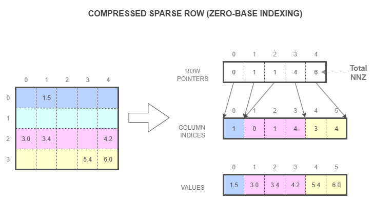
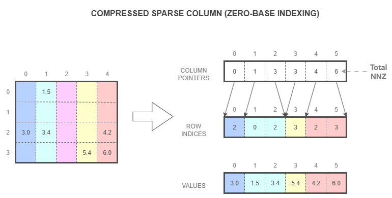

..
   Copyright (c) 2023-2025 Advanced Micro Devices, Inc.
..
   Permission is hereby granted, free of charge, to any person obtaining a copy
   of this software and associated documentation files (the "Software"), to deal
   in the Software without restriction, including without limitation the rights
   to use, copy, modify, merge, publish, distribute, sublicense, and/or sell
   copies of the Software, and to permit persons to whom the Software is
   furnished to do so, subject to the following conditions:
..
   The above copyright notice and this permission notice shall be included in all
   copies or substantial portions of the Software.
..
   THE SOFTWARE IS PROVIDED "AS IS", WITHOUT WARRANTY OF ANY KIND, EXPRESS OR
   IMPLIED, INCLUDING BUT NOT LIMITED TO THE WARRANTIES OF MERCHANTABILITY,
   FITNESS FOR A PARTICULAR PURPOSE AND NONINFRINGEMENT. IN NO EVENT SHALL THE
   AUTHORS OR COPYRIGHT HOLDERS BE LIABLE FOR ANY CLAIM, DAMAGES OR OTHER
   LIABILITY, WHETHER IN AN ACTION OF CONTRACT, TORT OR OTHERWISE, ARISING FROM,
   OUT OF OR IN CONNECTION WITH THE SOFTWARE OR THE USE OR OTHER DEALINGS IN THE
   SOFTWARE.

.. _SecStorage:

Storage Schemes
***************

This section describes the storage schemes that are supported in AOCL-Sparse with illustrative examples.

.. _storage_csr:

Compressed Sparse Row (CSR) Format
==================================
CSR (Compressed Sparse Row) is a common storage format for sparse matrices that stores all the nonzero elements in the row-wise order, i.e., all nonzeros of the first row are followed by all nonzeros in the second row, etc. The elements within the row can be stored in any order but it is often beneficial to have them sorted in the increasing order of their column indices.

The CSR format of a ``M x N`` sparse matrix with ``NNZ`` elements uses three arrays as follows:

- **row_ptr**: Array of size ``M+1`` that contains pointers to the start of each row in the **col_idx** and **val** arrays. The last element points to the total number of nonzero elements. The number of nonzeros in row ``i`` can be computed as ``row_ptr[i+1] - row_ptr[i]``.

- **col_idx**, **val**: Arrays of size ``NNZ`` containing the column indices and the corresponding values of each nonzero element, respectively.

CSR format can either use 0-based indexing (C, C++) where row and column indices start from 0 or 1-based (Fortran) where indices start from 1.

The above diagram shows a ``4 x 5`` matrix in CSR storage format with zero-based indexing.

- ``M = 4, N = 5, NNZ = 6``

- ``row_ptr[M+1] = {0, 1, 1, 4, 6}``

- ``col_idx[NNZ] = {1, 0, 1, 4, 3, 4}``

- ``val[NNZ] = {1.5, 3.0, 3.4, 4.2, 5.4, 6.0}``

.. _storage_csc:

Compressed Sparse Column (CSC) Format
======================================
CSC (Compressed Sparse Column) is a storage format for sparse matrices that stores all the nonzero elements in the column-wise order, i.e., all nonzeros of the first column are followed by all nonzeros in the second column, etc. The elements within the column can be stored in any order but it is often beneficial to have them sorted in the increasing order of their row indices.

The CSC format of a ``M x N`` sparse matrix with ``NNZ`` elements uses three arrays as follows:

- **col_ptr**: Array of size ``N+1`` that contains pointers to the start of each column in the **row_idx** and **val** arrays. The last element points to the total number of non-zero elements.

- **row_idx**, **val**: Arrays of size ``NNZ`` containing the row indices and the corresponding values of each nonzero element, respectively.

CSC format can either use 0-based indexing (C, C++) where row and column indices start from 0 or 1-based (Fortran) where indices start from 1.

The above diagram shows a ``4 x 5`` matrix in CSC storage format with zero-based indexing.

- ``M = 4, N = 5, NNZ = 6``

-  ``col_ptr[N+1] = {0, 1, 3, 3, 4, 6}``

-  ``row_idx[NNZ] = {2, 0, 2, 3, 2, 3}``

-  ``val[NNZ] = {3.0, 1.5, 3.4, 5.4, 4.2, 6.0}``

.. _storage_bsr:

Block Compressed Sparse Row (BSR) Format
===============================================
BSR (Block Compressed Sparse Row) is a sparse matrix storage format that groups nonzeros into fixed-size dense blocks (with zero padding if needed) and stores those blocks in a CSR-like structure. At present AOCL-Sparse only supports square blocks. Each block is of size ``block_dim``, having ``bM`` block rows and ``bN`` block columns. The elements inside all nonzero blocks are either stored in row-major or column-major order.

The BSR format of a ``bM`` x ``bN`` block sparse matrix will have ``bNNZ`` number of blocks. It uses three arrays as follows:

- **row_ptr**: Array of size ``bM+1`` that contains pointers to the start of each block row in the **col_idx** and (in strides of ``block_dim * block_dim``) **val** arrays. The last element points to the total number of nonzero blocks.

- **col_idx**: Array of size ``bNNZ`` containing the block column indices of each nonzero blocks.

- **val**: Array of size ``block_dim * block_dim * bNNZ`` containing all the nonzero elements of the matrix stored block by block, padded with zeros to fill the incomplete blocks.

BSR format can either use 0-based indexing or 1-based indexing similar to CSR and CSC formats.

.. image:: images/BSR.png
   :alt: BSR format diagram showing matrix storage structure
   :width: 80%
   :align: center

The above diagram shows a BSR matrix of block size ``2 x 3`` with ``block_dim = 2`` in 0-based indexing.

- ``bM = 2, bN = 3, bNNZ = 4``

- ``row_ptr[bM + 1] = {0, 1, 4}``

- ``col_idx[bNNZ] = {1, 0, 1, 2}``

**Row Major:**

- ``val[block_dim * block_dim * bNNZ] = {0, 0, 2.2, 0, 3.0, 3.4, 0, 0, 0, 0, 0, 5.4, 4.2, 0, 6.0, 0}``

**Column Major:**

- ``val[block_dim * block_dim * bNNZ] = {0, 2.2, 0, 0, 3.0, 0, 3.4, 0, 0, 0, 0, 5.4, 4.2, 6.0, 0, 0}``

.. note::
   In BSR representation, the actual dimensions of the matrix will have :math:`bM * block\_dim` number of rows and :math:`bN * block\_dim` number of columns.

.. _storage_tcsr:

Triangular Compressed Sparse Row (TCSR) Format
===============================================

.. _storage_coo:

Coordinate (COO) storage format
===============================
